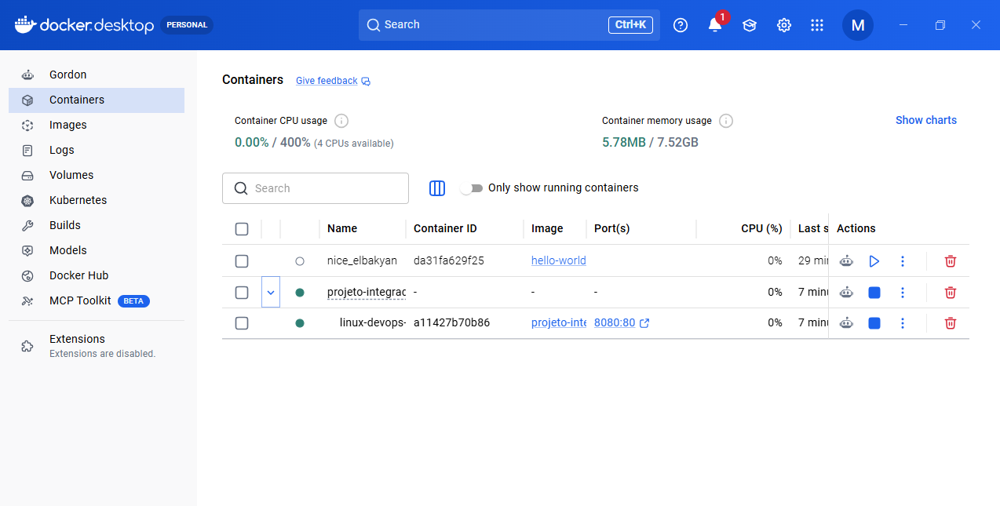
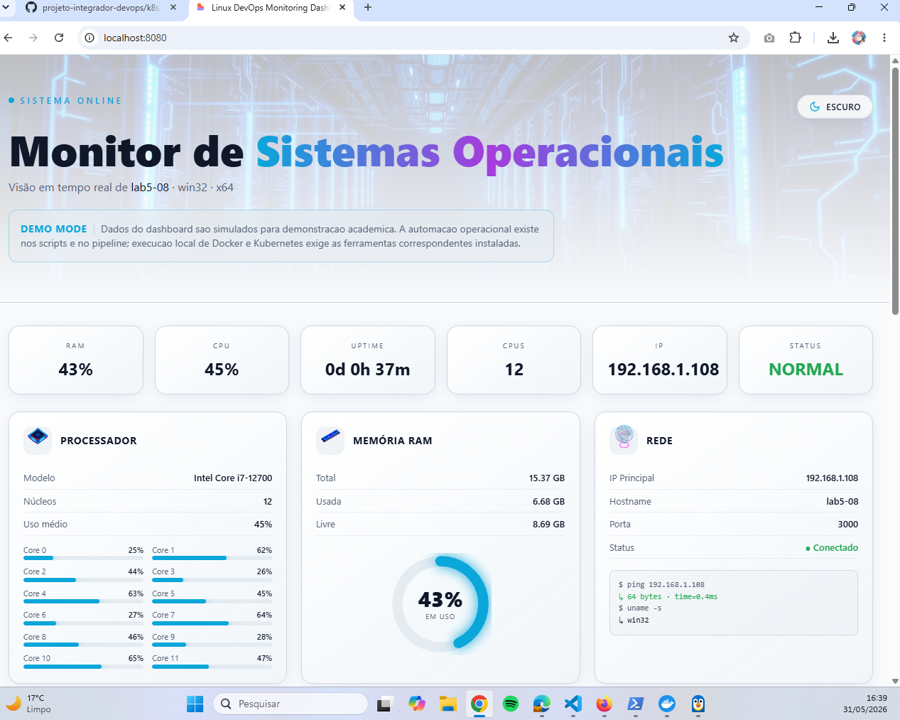
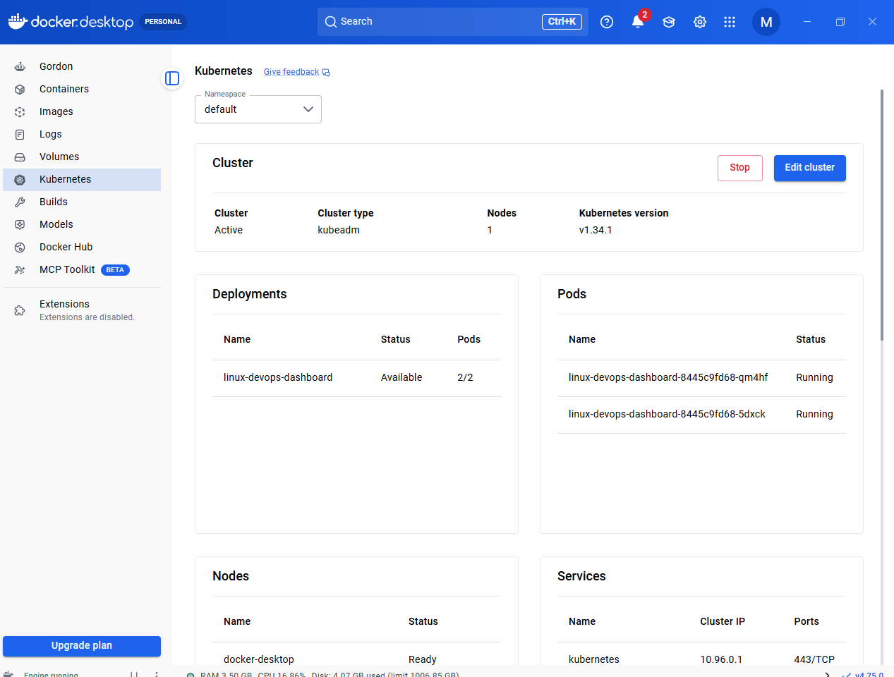
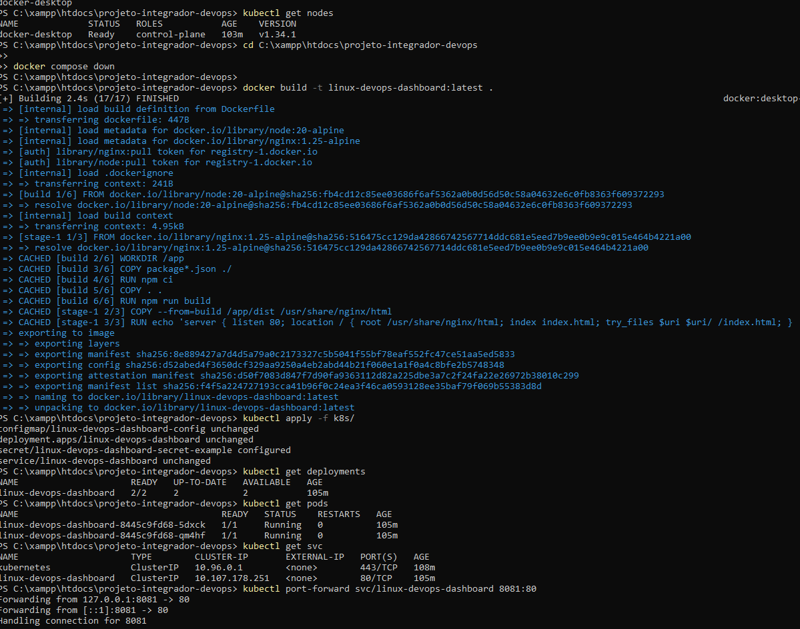
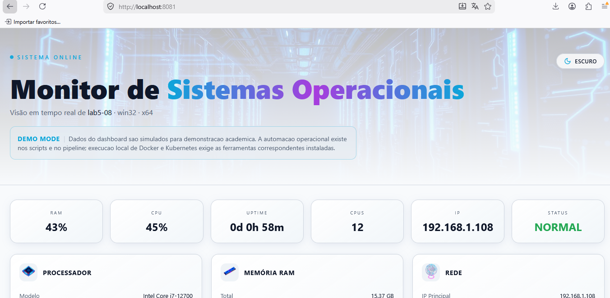

# Validação Local com Docker e Kubernetes

Este documento registra a validacao local da aplicacao usando Docker, Docker Compose e Kubernetes local via Docker Desktop. O objetivo e reunir comandos, evidencias e conclusoes tecnicas para avaliacao academica do projeto.

## Ambiente

A validacao foi realizada em ambiente local com:

- Windows
- Docker Desktop
- Docker Engine
- Docker Compose
- Kubernetes local via Docker Desktop
- kubectl

## Validação com Docker

### Comandos executados

Verificar versao do Docker:

```bash
docker --version
```

Verificar versao do Docker Compose:

```bash
docker compose version
```

Validar funcionamento basico do Docker Engine:

```bash
docker run hello-world
```

Construir a imagem local da aplicacao:

```bash
docker build -t linux-devops-dashboard:latest .
```

Executar a aplicacao com Docker Compose:

```bash
docker compose up --build -d
```

Inspecionar containers em execucao:

```bash
docker ps
```

Inspecionar servicos do Docker Compose:

```bash
docker compose ps
```

Acessar a aplicacao:

```text
http://localhost:8080
```

Encerrar o ambiente Docker Compose:

```bash
docker compose down
```

### Evidências

Container exibido no Docker Desktop:

Arquivo: `docs/assets/local-validation/docker-desktop-container.png`



Aplicacao acessivel localmente pela porta 8080:

Arquivo: `docs/assets/local-validation/docker-localhost-8080.png`



### Observação sobre healthcheck

A execucao com Docker funcionou e a aplicacao ficou acessivel em `http://localhost:8080`. Uma das evidencias, entretanto, mostra o healthcheck do container como `unhealthy`.

Esse estado nao impediu a execucao da aplicacao nem o acesso pelo navegador. Ainda assim, o comando de healthcheck pode ser melhorado em um refinamento futuro para refletir com mais precisao a disponibilidade do Nginx e da aplicacao estatica.

## Validação com Kubernetes

### Comandos executados

Inspecionar o cluster local:

```bash
kubectl get nodes
```

Construir a imagem local usada pelo Deployment:

```bash
docker build -t linux-devops-dashboard:latest .
```

Aplicar os manifests Kubernetes:

```bash
kubectl apply -f k8s/
```

Inspecionar Deployments:

```bash
kubectl get deployments
```

Inspecionar Pods:

```bash
kubectl get pods
```

Inspecionar Services:

```bash
kubectl get svc
```

Criar acesso local via port-forward:

```bash
kubectl port-forward svc/linux-devops-dashboard 8081:80
```

Acessar a aplicacao:

```text
http://localhost:8081
```

Remover os recursos Kubernetes:

```bash
kubectl delete -f k8s/
```

### Evidências

Dashboard do Kubernetes no Docker Desktop:

Arquivo: `docs/assets/local-validation/kubernetes-dashboard.png`



Validacao pelo terminal com `kubectl`:

Arquivo: `docs/assets/local-validation/kubectl-validation-terminal.png`



Aplicacao acessivel localmente pela porta 8081 via port-forward:

Arquivo: `docs/assets/local-validation/kubernetes-localhost-8081.png`



## Conclusão

A validacao local confirmou que o build Docker da aplicacao foi executado com sucesso e que a execucao via Docker Compose disponibilizou o dashboard em `http://localhost:8080`.

Tambem foi validado o uso de Kubernetes local pelo Docker Desktop. O Deployment apresentou 2 replicas disponiveis, os 2 Pods ficaram em estado `Running`, o Service foi criado como ponto de acesso interno do cluster e o acesso externo foi realizado por `kubectl port-forward` em `http://localhost:8081`.

Essas evidencias fortalecem a demonstracao de conteinerizacao, orquestracao, portabilidade e operacao local do projeto com Docker e Kubernetes, complementando os manifests, Dockerfile, Docker Compose e pipeline ja existentes no repositorio.
